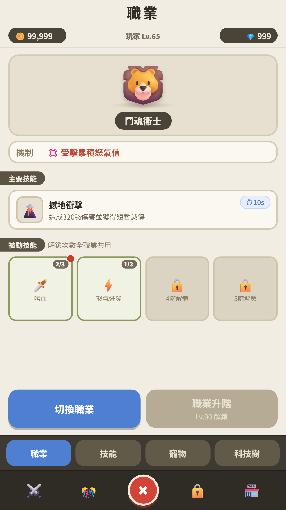

# 職業系統 Prototype

這是一份用來討論職業系統核心流程與 UI 資訊層級的互動 Prototype。

## 快速入口

- [開啟互動 Demo](https://hank-jc.github.io/career-system-prototype/)
- [閱讀 UI／UX Review 文件](./職業系統UIUX%20Review版.md)

## 目前涵蓋範圍

- Upgrades 頁中的「職業」分頁
- Lv.2 職業預覽與 Lv.5 首次選擇
- 三條職業線與五階共用職業階級
- 同頁職業升階與精簡確認
- 四個被動技能槽、三選一與全職業共用解鎖次數
- 免費切換職業與各職業獨立保存的被動配置
- 提前預覽／直接開放的 A/B 測試方向

目前技能名稱、數值與美術皆為流程佔位，不代表正式內容定案。

## 畫面預覽



## 重新產生 Demo 截圖

在 Windows PowerShell 執行：

```powershell
.\capture-demo.ps1
```

腳本預設將五個關鍵流程畫面輸出至 `demo-screenshots/`，尺寸為 1080×1920；也支援 `preview` 與 `pick` 場景供 Review 文件使用。

## 使用說明

本 repo 僅供 Prototype 展示與設計討論，目前未提供開放原始碼授權。
