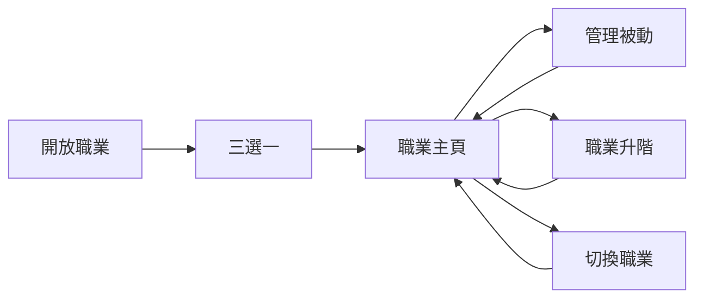
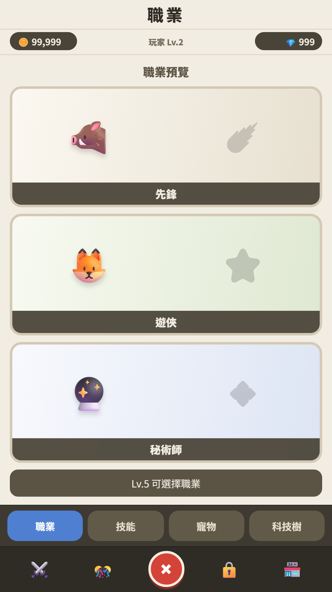
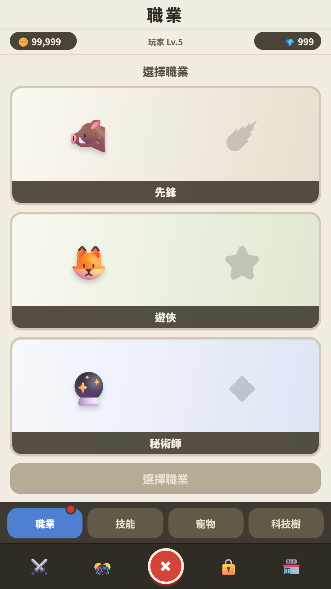
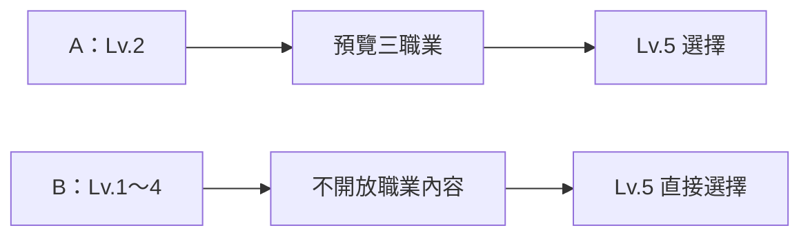
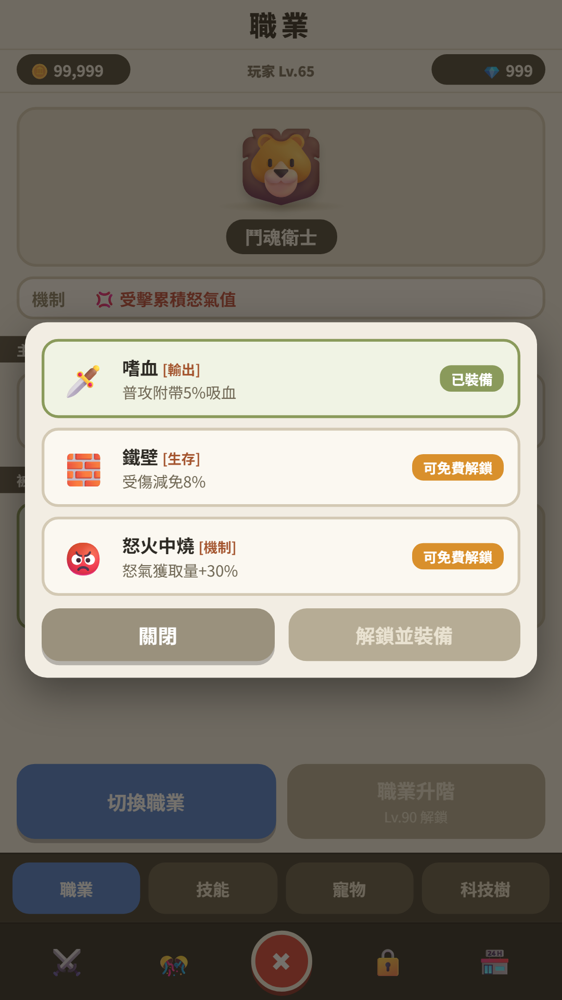
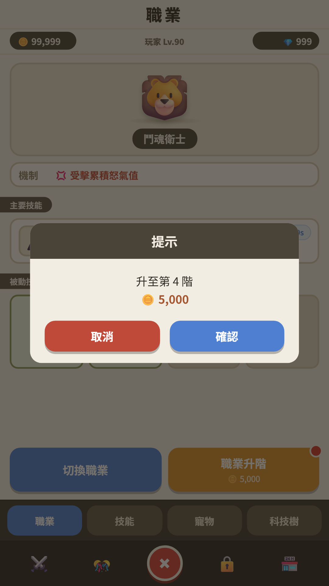
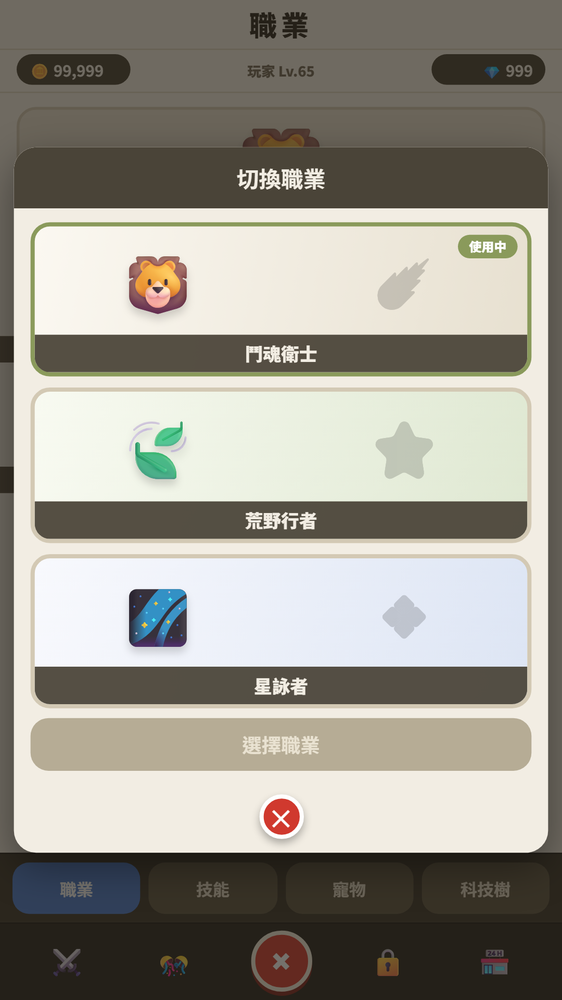

# 職業系統 UI／UX Review

> Prototype Review · 2026-07-15
> 這份文件用來快速確認玩家流程、畫面層級與操作感受。技能名稱、數值、圖示與角色美術皆為佔位；完整系統規則請看 [`職業系統規格.md`](./職業系統規格.md)。

## 一眼理解系統

玩家在早期解鎖職業系統，從三條職業線選擇一條開始遊玩。三條線共用五階成長進度，但各自保留主動技能、戰鬥機制與被動配置；玩家可隨時免費切換。

設計基準：**1080×1920、主要流程不需要上下滑動、同一時間只顯示一層正式操作彈窗。**

---

## 1. 系統開放與首次選擇

<table>
<tr>
<td width="50%" valign="top">

<strong>Lv.2 職業預覽</strong>

<ul>
<li>三張職業卡只顯示圖片與名稱，先建立期待。</li>
<li>卡片不可操作，底部只說明 Lv.5 才能選擇。</li>
<li>最低階使用全彩圖；終階只以同色剪影作為成長 hook。</li>
</ul>
</td>
<td width="50%" valign="top">

<strong>Lv.5 首次選擇</strong>

<ul>
<li>沿用相同三卡版型，避免玩家重新理解畫面。</li>
<li>選中卡片後才開放底部確認按鈕。</li>
<li>確認後直接進入職業主頁，不增加介紹頁或成功頁。</li>
</ul>
</td>
</tr>
</table>

### 開放方式 A/B

- 第一階段固定使用玩家等級，只比較「提前預覽」與「直接開放」。
- 後續可再比較玩家等級與關卡進度；`Lv.2／Lv.5` 和 `1-5／1-10` 目前都是暫定值，兩組必須校準在相近遊戲時間發生。
- 首次選擇後，玩家 Lv.5 以上會出現一次性引導任務「切換職業」。

---

## 2. 職業主頁

主頁只回答玩家此刻需要知道的事情：

1. **我是誰**：職業圖片與名稱是第一視覺焦點。
2. **怎麼運作**：機制只用一句話說明，例如「受擊累積怒氣值」。
3. **我有什麼能力**：主動技能完整顯示；四個被動槽固定保留位置。
4. **下一步做什麼**：底部只留下切換職業與職業升階。

---

## 3. 被動技能

每個被動槽提供三個候選。玩家看到的是「目前裝備／可以免費解鎖／需要付費解鎖」三種操作狀態，不需要先理解完整資料規則。

---

## 4. 職業升階

升階不使用獨立頁面。玩家在職業主頁按下可用的升階按鈕後，只看到階級與消耗確認；完成後直接回到同一主頁更新圖片、名稱、主動技能與被動槽。

---

## 5. 切換職業

切換職業沿用首次選擇的三張卡片。玩家選擇目標後直接切換並回到更新後的職業主頁。

---

## 6. 四個必須維持的系統認知

| 玩家需要理解 | UI 如何傳達 |
|---|---|
| 三條職業線共用五階進度 | 切換後直接使用相同階級，不要求重新升階 |
| 第二至五階各開放一個被動槽 | 主頁固定顯示四槽，未開放槽直接標示階級 |
| 被動解鎖次數共用、技能配置各線保存 | 槽位顯示 `N/3`；切回原職業恢復原配置 |

---

## 參考

- [可操作 Demo](./職業系統demo.html)
- [完整系統規格](./職業系統規格.md)
- 舊版 Review 文件保留供歷史比較；本文件為目前設計 Review 的主要入口。
