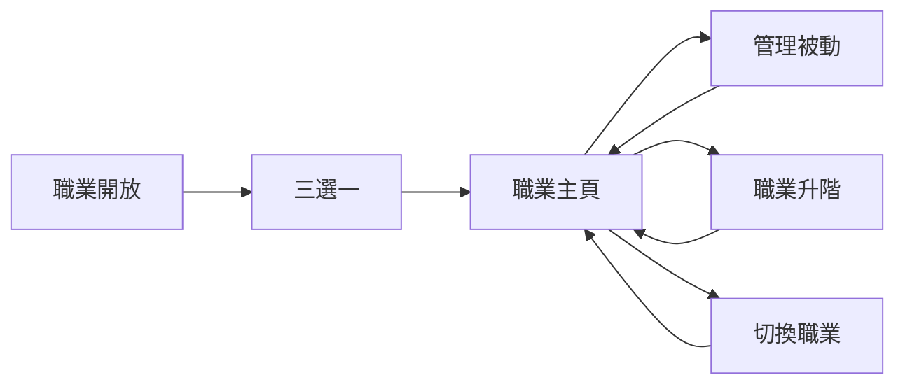

# 職業系統｜UI／UX Review

> 本文件只用來快速確認玩家流程與畫面層級。完整規則以 [`職業系統規格.md`](./職業系統規格.md) 為準；美術外框與細節以 [`職業系統美術定版UIUX說明.md`](./職業系統美術定版UIUX說明.md) 為準。

## 核心流程

- 基準畫面：1080×1920。
- 主頁與主要彈窗不需上下捲動。
- 同一時間只顯示一層正式操作彈窗。
- Demo 圖只作排版與流程參考，不是正式美術稿。

---

## 1. 系統開放與首次選擇

### 開放狀態

| 玩家狀態 | 畫面 |
|---|---|
| Lv.1 | 鎖定資訊 |
| Lv.2～4 | 三張唯讀職業卡與 Lv.5 提示 |
| Lv.5 以上 | 三張可選職業卡與確認按鈕 |

### 卡片資訊

- 三張卡片由上到下平均排列。
- 左側文字、右側最低階職業圖，各占約一半。
- 只顯示職業名稱、定位 Tag、`技能` 小標與第一階主動技能名稱。
- 不顯示武器、機制、技能敘述、被動列表或終階剪影。
- 確認後直接進入職業主頁，不增加介紹頁或成功頁。

第一優先 A/B 只比較是否在 Lv.2 提供預覽；兩組都在 Lv.5 正式開放。

---

## 2. 職業主頁

主頁依序回答：

1. **目前職業**：左上職業圖與名稱。
2. **目前主動技能**：右上技能圖示、名稱與短說明；不顯示冷卻。
3. **被動配置**：下方五個槽位以五芒星概念排列。
4. **下一步**：底部只保留切換職業與職業升階／預覽。

- 玩家等級與經驗只在頂部中央顯示。
- 被動技能標題旁只說明一次「解鎖次數全職業共用」。
- 主頁不顯示職業精通、機制欄、武器偏好或被動分類標籤。
- 第一至四階各開放一個槽位；第五槽本版維持鎖定。

---

## 3. 被動技能 3 選 1

- 使用置中單一彈窗，不先展開 bubble。
- 三個候選同時顯示圖示、名稱、短說明與操作狀態。
- 標題只顯示「選擇被動技能・槽位 N」，不重複解釋共用規則。
- 玩家可免費使用尚未使用的共用解鎖額度；額度用完後才顯示提高共用次數的費用。
- 已解鎖候選可免費切換。
- 解鎖或裝備後彈窗維持開啟，直到玩家主動關閉。

玩家只需要從狀態理解「可免費解鎖／需要付費提高次數／已解鎖可裝備」，不需先閱讀完整資料規則。

---

## 4. 職業升階

- 等級不足時，主頁入口仍可點擊並顯示「職業升階預覽」。
- 上方橫向路線以目前職業與下一階為構圖中心。
- 已取得階級與下一階顯示完整角色圖；更後面的階級顯示同色輪廓。
- 下一階使用清楚但符合專案風格的選取效果。
- 下方一次顯示「第 N 階開放・被動技能 3 選 1」與三個候選。
- 不顯示主動技能前後變化、候選圓圈、被動分類標籤或重複消耗文字。
- 完成後直接返回主頁，更新職業圖並短暫強調新槽位；不顯示成功頁。

---

## 5. 切換職業

- 上方直接比較目前職業與目標職業。
- 顯示目標職業在目前共用階級下的主動技能與五個被動槽。
- 左側按鈕「改看○○」切換到另一個預覽目標。
- 右側按鈕「切換為○○」執行免費切換。
- 完成後直接回到職業主頁，不顯示確認或成功頁。

---

## 6. 必須維持的玩家認知

| 玩家需要理解 | UI 傳達方式 |
|---|---|
| 三條職業線共用四階進度 | 切換後直接使用目前階級 |
| 第一至四階各開一個被動槽 | 五槽固定可見，未開放槽顯示鎖定 |
| 第五槽目前沒有開放來源 | 固定鎖定，不假裝有第五階 |
| 解鎖次數全職業共用 | 被動標題說明一次，槽位顯示 `N/3` |
| 各職業的被動配置獨立保存 | 切回職業時恢復原配置 |
| 職業不限制裝備 | 職業頁不顯示武器限制或裝備替換資訊 |

---

## 7. Review 重點

- 三張首次選擇卡是否能以角色圖為第一視覺，且資訊不過量。
- 五芒星被動配置是否能在單畫面中清楚呈現五種槽位位置。
- 共用解鎖次數與各職業獨立配置是否能透過 UI 狀態理解。
- 升階與切換 Overlay 是否足夠比較目標，又不形成第二套技能管理頁。
- 主要流程是否都能在單層彈窗中完成。
