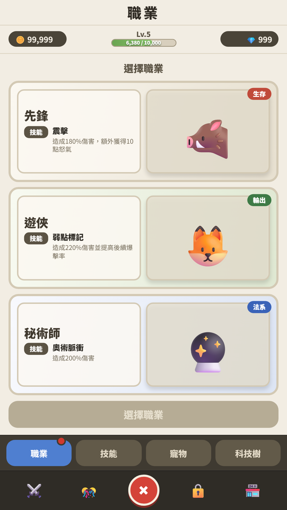
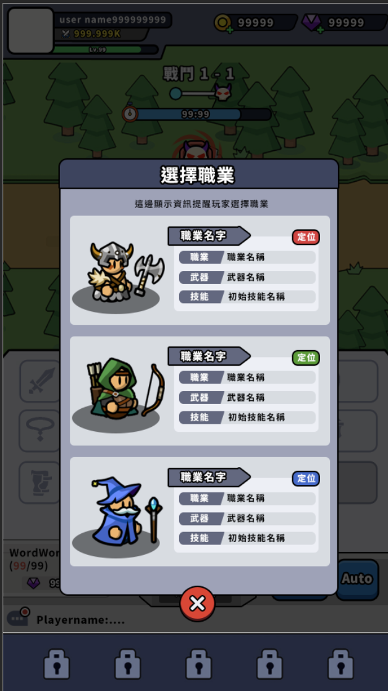
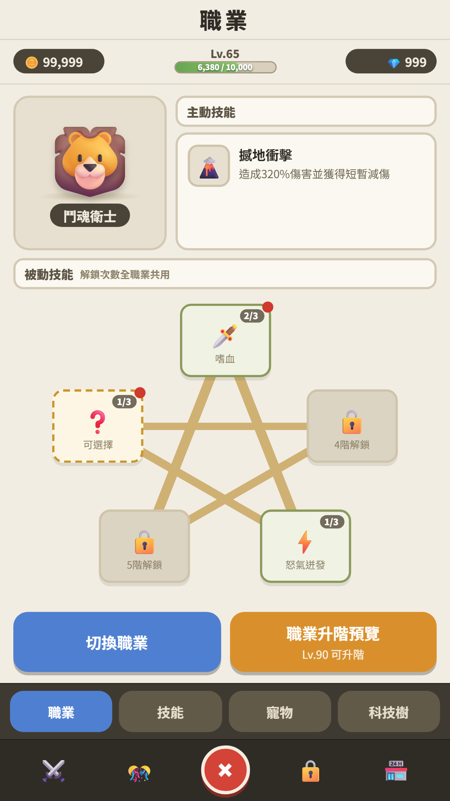
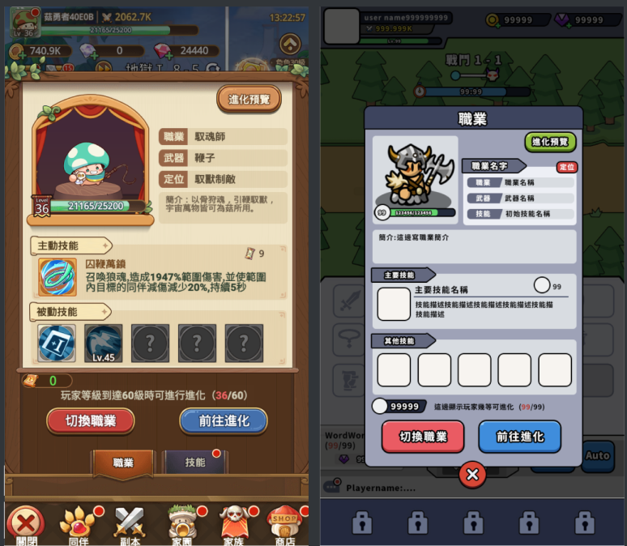
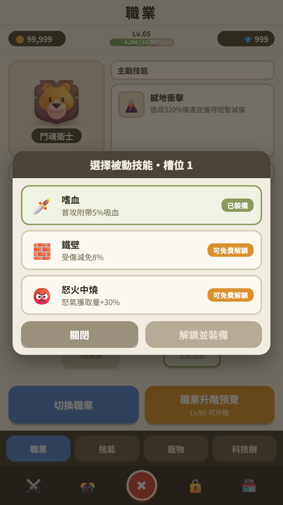
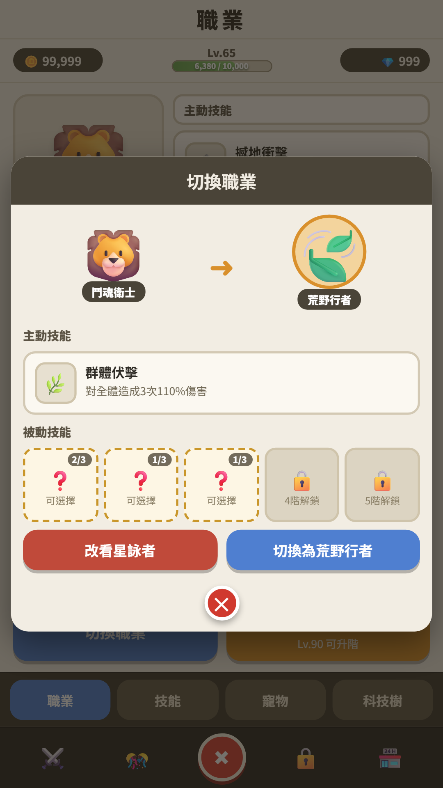
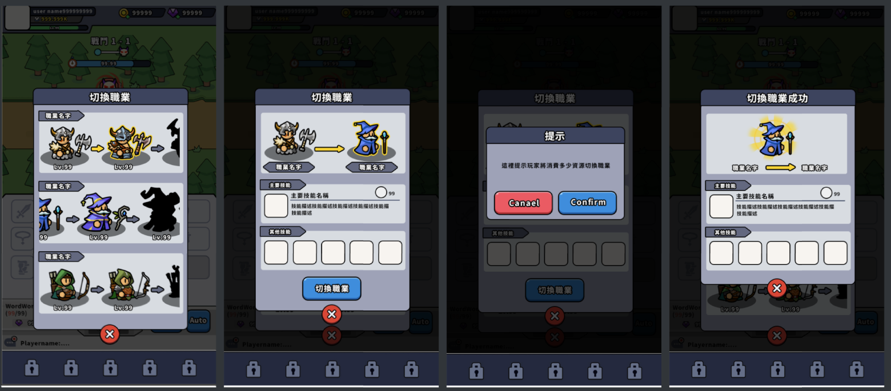
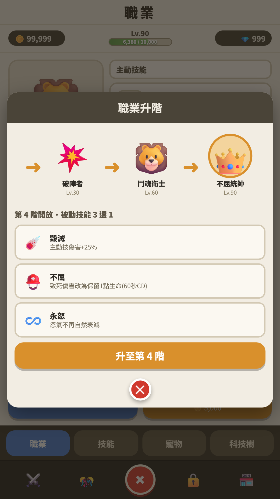

# 職業系統｜美術定版畫面需求

> 本文件只說明靜態 PSD／PNG 的畫面構圖與狀態需求。
>
> **Demo 圖用來確認排版與資訊層級，不代表正式美術風格。** 外框、底板、按鈕、配色、標題與裝飾細節，請依遊戲現有介面重新設計。

---

## 1. 參考圖的用途

| 參考圖 | 用途 |
|---|---|
| **Demo 截圖** | 元素配置、比例、畫面容量與資訊層級 |
| **既有美術示意圖** | 遊戲內的外框、底板、按鈕、標題與整體視覺語言 |

Demo 裡的黃色圓圈、金色框、米色底板、Emoji、圓角與陰影都是臨時示意，不是定版要求。

文件中提到「強調目前選擇」或「強調升階目標」時，只代表該狀態需要清楚可辨；呈現方式可使用專案既有的底板、描邊、光效、箭頭或其他做法。

### 共通畫面條件

- 基準尺寸：1080 × 1920，直式畫面。
- 職業系統位於 Upgrades 的第一個頁籤。
- 頂部資源列、Upgrades 頁籤與底部主導覽沿用遊戲既有結構。
- 角色圖片是主要視覺，文字與裝飾不應搶過角色。
- 技能名稱、技能敘述、數值與 Emoji 目前都是佔位內容。

---

## 2. 初次選擇職業

### 排版參考

### 風格參考

### 畫面構成

- 三張職業卡片由上到下排列、尺寸一致並平均分配空間。
- 兩區對齊且各自有清楚結構。
- 文字放左側，角色圖放右側。
- 角色圖使用該職業線的最低階造型。
- 卡片內容包含：
  - 職業名稱
  - 右上角定位 Tag
  - 機制短句
  - 主動技能名稱
  - 五個被動技能名稱
- 定位 Tag 不遮住角色主體。

卡片造型、分區方式、Tag、角色底座、陰影與裝飾由美術依專案風格處理。

---

## 3. 職業主頁

### 排版參考

### 風格參考

### 畫面構成

- 上半部左側：當前職業角色圖與職業名稱。
- 上半部右側：主動技能區。
  - 技能圖示放左側。
  - 技能名稱與短敘述放右側。
  - 不顯示冷卻時間。
- 主動技能與被動技能需要有清楚的區段標題。
- 下半部主要空間放置五個被動技能槽。
- 五個被動技能槽以五芒星概念排列。
- 技能槽大小一致，連線與箭頭需要清楚，不被技能格或裝飾遮住。
- 被動技能不顯示「輸出／生存／機制」分類標籤。
- 底部保留「切換職業」與「職業升階／升階預覽」兩個並排按鈕。

### 需要提供的技能槽靜態狀態

- 已裝備
- 可選擇
- 已開放但未選
- 未開放
- 新開放強調

以上狀態只需在視覺上清楚區分，不要求使用 Demo 的綠框、虛線、問號、鎖頭或黃色外圈。

---

## 4. 被動技能 3 選 1

### 排版參考

### 畫面構成

- 置中彈窗，包含標題區、三個候選技能與底部操作區。
- 標題顯示目前選擇的被動槽位。
- 三個候選技能同時完整顯示，構圖上要清楚傳達「三選一」。
- 每個候選技能包含圖示、名稱與短敘述。
- 底部包含關閉按鈕與「解鎖並裝備」主要按鈕。

### 需要提供的靜態狀態

- 尚未選擇候選技能
- 已選擇其中一個候選技能
- 「解鎖並裝備」按鈕可用／不可用

三選一的選中方式、卡片造型及按鈕細節由美術依專案風格處理。

---

## 5. 切換職業

### 排版參考

### 風格參考

### 畫面構成

- 上方同時顯示目前職業與目標職業，中間使用方向箭頭連接。
- 目標職業需要有清楚的視覺強調。
- 中段顯示目標職業的主動技能與五個被動技能狀態。
- 底部並排兩個按鈕：
  - 左側：改看另一條職業線。
  - 右側：切換為目前顯示的職業。
- 不顯示切換費用。

比較區底板、角色底座、箭頭、選取效果及按鈕配色可依專案風格調整。

---

## 6. 職業升階／升階預覽

### 排版參考

### 畫面構成

- 上方為橫向職業進階路線，可視範圍以目前職業與下一階職業為構圖中心。
- 已解鎖職業與下一階職業顯示完整角色圖。
- 更後面的階級顯示同色輪廓。
- 每個角色下方顯示職業名稱，階級之間使用方向箭頭連接。
- 下一階職業需要有清楚的視覺強調。
- 下方標題顯示「第 N 階開放・被動技能 3 選 1」。
- 三個候選技能同時完整顯示。
- 候選技能前不需要單選圓圈，也不需要額外的 3→1 圖示。
- 底部保留關閉按鈕與「職業升階／職業升階預覽」按鈕。
- 不顯示主動技能變化與升階消耗小字。

### 需要提供的靜態狀態

- 等級不足：職業升階預覽
- 等級足夠：職業升階
- 新開放被動技能槽的強調狀態

---

## 7. 美術交付項目

### 定版畫面 PSD／PNG

1. 初次選擇職業
2. 職業主頁
3. 被動技能 3 選 1
4. 切換職業
5. 職業升階預覽
6. 可進行職業升階

### 共用元件與狀態 PNG

- 職業卡片與定位 Tag
- 主動技能圖示框
- 被動技能槽五種狀態
- 方向箭頭
- 目前職業／目標職業／下一階職業的辨識狀態
- 一般／不可用按鈕

---

**Demo 回答「畫面要放什麼、相對放在哪裡」；正式 PSD／PNG 回答「這些內容在遊戲裡應該長什麼樣子」。**
