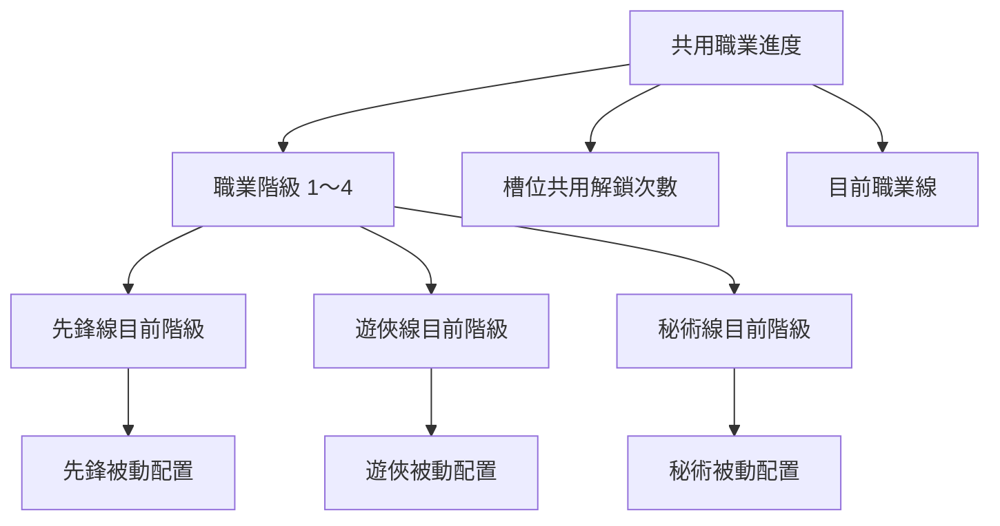

# 職業系統規格

> 文件狀態：實作基準
>
> 最後更新：2026-07-17
>
> 本文件是職業系統的唯一完整規格。若 Demo、Review 文件或美術說明與本文件不同，以本文件為準。技能名稱、技能效果、美術名稱與平衡數值若標示為佔位，實作時必須由設定資料提供，不可寫死為正式內容。

---

## 1. 系統目標與範圍

職業系統是玩家完成鍛造基礎循環後，早期接觸的第一批戰鬥養成系統之一。

- 玩家透過戰鬥取得裝備，並由鍛造／出售裝備提升玩家等級。
- 職業系統提供三條可免費切換的玩法路線。
- 三條職業線共用職業階級，但各自保存被動技能的解鎖與裝備配置。
- 職業提供主動技能、被動技能與職業專屬戰鬥資源。
- 職業不介入裝備掉落、裝備限制、戰鬥角色外觀或近戰／遠程判定。

### 1.1 本次實作範圍

- 系統開放、預覽與首次選擇。
- 三條職業線與四階共用職業階級。
- 五個被動技能槽，其中前四槽有階級開放來源。
- 每槽三個固定候選、共用解鎖次數與各職業獨立配置。
- 職業主頁、被動技能彈窗、切換職業與職業升階。
- 系統紅點、升階／切換回饋與必要數據追蹤。

### 1.2 不在本次範圍

- 第五被動槽的開放來源。
- 正式職業名稱、技能內容、倍率與平衡數值定案。
- 怒氣、專注、奧能的完整上限、衰減、消耗與滿值效果。
- 職業角色圖套用至戰鬥角色。
- 新手手指指引或逐步強制教學。

---

## 2. 名詞與資料歸屬

### 2.1 名詞

| 名詞 | 定義 |
|---|---|
| 職業線 | 一組獨立的職業名稱、職業圖、主動技能、被動候選與專屬戰鬥資源。初期共三條。 |
| 職業階級 | 三條職業線共用的成長階段。本次共四階。 |
| 被動槽 | 裝備一個被動技能的位置。主頁固定顯示五槽。 |
| 候選技能 | 每條職業線、每個被動槽固定提供的三個技能。 |
| 共用解鎖次數 | 同一槽位在每條職業線最多可免費解鎖到的候選數量，範圍為 `0/3`～`3/3`。它是上限，不是會被消耗的次數。 |

### 2.2 資料歸屬

| 資料 | 全職業共用 | 各職業線獨立 | 既有系統負責 |
|---|:---:|:---:|:---:|
| 系統是否已正式解鎖 | ✓ |  |  |
| 是否完成首次選擇 | ✓ |  |  |
| 目前使用中的職業線 | ✓ |  |  |
| 職業階級 | ✓ |  |  |
| 每槽共用解鎖次數 | ✓ |  |  |
| 各階職業名稱與職業圖 |  | ✓ |  |
| 各階主動技能 |  | ✓ |  |
| 每槽三個被動候選 |  | ✓ |  |
| 已解鎖的被動候選 |  | ✓ |  |
| 目前裝備的被動候選 |  | ✓ |  |
| 怒氣／專注／奧能規則 |  | ✓ |  |
| 玩家等級與經驗值 |  |  | ✓ |
| 金幣、鑽石與消耗 |  |  | ✓ |
| 裝備掉落、外觀與攻擊方式 |  |  | ✓ |



### 2.3 建議保存狀態

實作可依專案架構調整命名，但必須能完整保存以下狀態：

```text
CareerProgress
  selectedLineId: null | CareerLineId
  careerStage: 0 | 1 | 2 | 3 | 4
  slotUnlockCounts[5]: 0..3
  lineProgress[CareerLineId]
    slots[5]
      unlockedOptionIds: OptionId[]
      equippedOptionId: null | OptionId
```

- 尚未首次選擇時 `selectedLineId = null`、`careerStage = 0`。
- 完成首次選擇後進入第一階。
- 不保存各職業線獨立階級；三條線永遠使用同一個 `careerStage`。
- `equippedOptionId` 必須屬於該槽的 `unlockedOptionIds`，否則視為無裝備。

---

## 3. 系統入口與開放

### 3.1 頁面位置

- 職業位於 `Upgrades` 的第一個頁籤。
- 後續頁籤依序為技能、寵物、科技樹。
- 職業頁籤從玩家 Lv.1 起可見。
- 正式可選擇職業時，頁籤顯示紅點；完成首次選擇後移除這個紅點。

### 3.2 首次上線預設條件

第一版以玩家等級作為開放依據：

| 玩家狀態 | 頁面內容 |
|---|---|
| Lv.1 | 鎖定畫面，顯示「Lv.2 開放職業預覽」 |
| Lv.2～4 | 三張唯讀職業卡與「Lv.5 可選擇職業」 |
| Lv.5 以上且未選擇 | 三張可選職業卡、確認按鈕與頁籤紅點 |
| 已完成首次選擇 | 職業主頁 |

`Lv.2` 與 `Lv.5` 是首版設定值，必須由設定資料提供。

### 3.3 開放方式 A/B

第一優先只測試是否提供提前預覽，正式解鎖條件固定為 Lv.5：

| 組別 | Lv.1～4 | Lv.5 |
|---|---|---|
| A：提前預覽 | Lv.2 起顯示唯讀三職業卡 | 正式開放選擇 |
| B：直接開放 | 只顯示鎖定資訊，不顯示職業卡 | 正式開放選擇 |

- 兩組共用相同職業卡、首次選擇流程與紅點規則。
- 第一版預設採 A 組。
- 不同組別不得同時改變職業內容、解鎖等級或提示強度。

### 3.4 後續候選：玩家等級或關卡進度

後續可測試開放依據，但不列入第一版必要實作：

| 開放依據 | 預覽門檻（暫定） | 正式解鎖門檻（暫定） |
|---|---|---|
| 玩家等級 | Lv.2 | Lv.5 |
| 通過關卡 | 1-5 | 1-10 |

- 門檻必須依數據校準，使兩組在相近遊戲時間發生。
- 若遊戲時間未對齊，不可把結果單純歸因於開放依據。

### 3.5 引導任務「切換職業」

玩家同時符合以下條件後，開放一次性引導任務：

- 玩家等級達到 Lv.5。
- 職業系統已正式解鎖。
- 已完成第一次職業選擇。

任務目標為成功切換至另一條職業線一次。獎勵沿用引導任務系統設定，不由職業系統定義。

---

## 4. 職業內容結構

### 4.1 職業線

初期三條職業線以以下名稱作為 Prototype 代稱：

| 職業線 | 定位 Tag | 專屬資源 | 累積方式 |
|---|---|---|---|
| 先鋒 | 生存 | 怒氣 | 受到傷害時累積 |
| 遊俠 | 輸出 | 專注 | 攻擊命中時累積 |
| 秘術 | 法系 | 奧能 | 施放技能時累積 |

- 職業名稱描述玩法氣質或世界觀身分，不綁定特定武器，例如使用「遊俠」而非「弓箭手」。
- 定位 Tag、職業名稱與技能內容仍可由內容設計調整。
- 職業專屬資源的完整規則尚未定案；職業頁目前不顯示專屬資源說明欄。

### 4.2 四階職業進度

- 三條職業線共用一條四階進度。
- 每條線每階有自己的職業名稱、職業圖與主動技能。
- 升至第 N 階時，三條線同時取得第 N 階內容。
- 切換職業後直接使用目前共用階級，不需要重新升階。

首版 Prototype 門檻：

| 階級 | 玩家等級門檻 | 開放內容 |
|---|---:|---|
| 第 1 階 | Lv.5 | 首次職業、第一階主動技能、被動槽 1 |
| 第 2 階 | Lv.30 | 第二階職業圖與主動技能、被動槽 2 |
| 第 3 階 | Lv.60 | 第三階職業圖與主動技能、被動槽 3 |
| 第 4 階 | Lv.90 | 第四階職業圖與主動技能、被動槽 4 |

- 等級門檻與升階消耗必須設定化。
- 第一階由首次選擇取得，不收升階費用。
- 第五被動槽固定顯示，但目前維持鎖定，沒有對應職業階級與開放來源。


### 4.3 主動技能

- 每條職業線每一階有一個主動技能。
- 升階後，目前職業線的主動技能替換為新階技能。
- 切換職業後，改用目標職業線在目前共用階級的主動技能。
- 職業頁顯示技能圖示、名稱與短說明，不顯示冷卻時間。
- 正式傷害、冷卻、資源互動與技能效果由技能設定資料提供。

---

## 5. 首次選擇職業

### 5.1 畫面

- 三張職業卡由上到下排列，等高、等距且對齊。
- 卡片左、右各占約 50%：左側文字，右側最低階職業圖。
- 文字區與圖片區各自形成清楚區塊，但正式外框造型由美術決定。
- 卡片只顯示：
  - 職業名稱。
  - 右上角定位 Tag。
  - `技能` 小標與第一階主動技能名稱。
- 不顯示武器、機制說明、主動技能敘述、被動技能列表或終階剪影。
- 預覽與可選狀態沿用同一版型。

### 5.2 操作

- 預覽階段的卡片不可選擇。
- 正式開放後，點擊卡片切換選中狀態；未選中任何卡片時確認按鈕不可用。
- 確認後：
  1. 保存目前職業線。
  2. 共用職業階級設為第 1 階。
  3. 被動槽 1 的共用解鎖次數至少設為 `1/3`。
  4. 不自動替玩家選擇被動技能。
  5. 直接進入職業主頁並顯示待選被動紅點。
- 不顯示二次確認、職業介紹頁或選擇成功頁。

---

## 6. 職業主頁

### 6.1 畫面層級

設計基準為 1080×1920，主頁不得要求上下捲動。

1. 頁面標題：置中顯示「職業」。
2. 玩家資訊列：左側金幣、中央 `Lv.N` 與經驗條、右側鑽石。
3. 職業資訊區：左側目前職業圖與名稱，右側主動技能。
4. 被動技能區：五個槽位以五芒星概念排列。
5. 底部操作：切換職業、職業升階／升階預覽。

### 6.2 主動技能區

- 區段標題為「主動技能」。
- 技能圖示放左側，名稱與短敘述放右側。
- 不顯示冷卻時間。

### 6.3 被動技能區

- 區段標題為「被動技能」。
- 標題旁只說明一次「解鎖次數全職業共用」。
- 五個槽位位於五芒星的五個頂點，槽位大小一致。
- 槽位顯示技能圖示／待選／鎖定狀態及共用解鎖次數 `N/3`。
- 不顯示輸出、生存、機制等被動分類標籤。

### 6.4 底部按鈕

| 狀態 | 左側 | 右側 |
|---|---|---|
| 未達下一階等級 | 切換職業 | 職業升階預覽；正常可點，不反灰，副文字顯示 `Lv.X 可升階` |
| 可升階 | 切換職業 | 職業升階；顯示升階消耗 |
| 已達第四階 | 切換職業 | 職業階級已滿；不可操作 |

### 6.5 主頁不顯示

- 職業精通、生命加成或攻擊加成。
- 職業機制說明欄。
- 職業定位、武器偏好或職業線長篇說明。
- 重複的玩家等級或職業名稱。

---

## 7. 被動技能

### 7.1 槽位與候選

- 主頁固定顯示五個被動槽。
- 第 1～4 階分別開放槽位 1～4；槽位 5 本版維持鎖定。
- 每條職業線、每個槽位固定提供三個候選技能，不在開啟彈窗時隨機產生。
- 每個槽位同時只能裝備一個候選。
- 玩家可以暫時不選，不阻擋升階或切換職業。
- 已解鎖候選可隨時免費切換。

### 7.2 共用解鎖次數

每個槽位有一個全職業共用的解鎖上限：

- 槽位首次隨階級開放時，共用解鎖次數設為至少 `1/3`。
- `N/3` 表示每條職業線在該槽最多可以解鎖 N 個候選。
- 某條職業線使用免費選擇權，不會扣除其他職業線的權利。
- 玩家可在任一職業線支付設定資源，將該槽共用解鎖次數永久提升一級，最高 `3/3`。
- 共用解鎖次數提高後，其他職業線立即取得相同的候選解鎖上限，但不會自動選擇技能。

範例：

```text
槽位1共用解鎖次數 = 3/3

先鋒：已解鎖3個候選，可自由切換
遊俠：已解鎖1個候選，仍有2次免費候選解鎖權
秘術：尚未選擇，可依序免費解鎖3個候選
```

### 7.3 解鎖與裝備規則

玩家在被動彈窗選擇候選後：

1. 若候選已解鎖：免費裝備，不改變共用解鎖次數。
2. 若該職業線已解鎖數量小於共用解鎖次數：免費解鎖並裝備。
3. 若已用完免費額度且共用解鎖次數小於 `3/3`：支付設定資源，共用解鎖次數 `+1`，再解鎖並裝備該候選。
4. 若共用解鎖次數已為 `3/3`，三個候選都必須能在該職業線解鎖；不得出現需要第四次付費的狀態。

單次操作必須原子完成：扣除資源、提高共用次數、解鎖候選與裝備候選不可只完成其中一部分。

### 7.4 各職業線獨立保存

- 共用的是每個槽位可解鎖的候選數量上限。
- 各職業實際解鎖了哪些候選、目前裝備哪一個，分別保存。
- 切換職業不會清除、覆蓋或自動重選被動。
- 切回原職業時恢復離開前的配置。

### 7.5 槽位 UI 狀態

| 狀態 | 顯示 |
|---|---|
| 階級未達／暫無來源 | 鎖定與開放條件；不可操作 |
| 可選擇 | 問號或待選圖示、`N/3`；有未使用免費額度時顯示紅點 |
| 已裝備 | 技能圖示、名稱與 `N/3` |
| 新開放 | 在升階返回主頁時提供一次短暫強調 |

「已開放但未選」包含在「可選擇」狀態，不需要另一套美術狀態。

### 7.6 被動技能彈窗

- 點擊已開放槽位後，開啟置中的單一彈窗。
- 標題為「選擇被動技能・槽位 N」。
- 不顯示重複的共用規則副標。
- 三個候選同時顯示圖示、名稱、短說明與目前操作狀態。
- 視覺上必須清楚傳達三選一，不使用額外巢狀技能彈窗。
- 底部顯示「關閉」與「解鎖並裝備」。
- 解鎖、裝備或切換後，彈窗維持開啟並即時更新；玩家按下關閉才離開。
- 候選不顯示輸出、生存、機制等分類標籤。

---

## 8. 職業升階

### 8.1 條件

- 必須達到下一階玩家等級門檻。
- 必須支付下一階設定的升階資源。
- 第一階由首次選擇取得；第二至四階才執行升階操作。

### 8.2 升階預覽 Overlay

- 主頁的升階預覽按鈕在等級不足時仍可開啟 Overlay。
- 同一時間只顯示這一層正式操作 Overlay。
- 上方為可水平滑動的四階職業路線，不顯示 scrollbar。
- 開啟時將目前階級與下一階置中。
- 已取得階級與下一階使用完整角色圖；更後面的階級使用同色輪廓。
- 每個角色下方顯示名稱，階級之間用箭頭連接。
- 不顯示「目前」文字；下一個升階目標使用專案一致的選取效果強調。
- 不顯示主動技能前後變化。

### 8.3 下一階被動預覽

- 標題為「第 N 階開放・被動技能 3 選 1」。
- 一次完整顯示下一個槽位的三個候選：圖示、名稱、短說明。
- 候選在此只能預覽，不直接選擇。
- 不顯示候選前置圓圈、額外 3→1 圖示、被動分類標籤或重複的消耗小字。

### 8.4 升階按鈕狀態

| 條件 | Overlay 按鈕 |
|---|---|
| 等級或資源不足 | 顯示「升至第 N 階」，不可操作 |
| 條件皆達成 | 顯示「升至第 N 階」，可操作 |
| 已達第四階 | 顯示「職業階級已滿」，不可操作 |

升階消耗已由主頁入口按鈕呈現，Overlay 不重複顯示消耗小字。

### 8.5 完成升階

成功後依序處理：

1. 原子扣除升階資源並把共用職業階級 `+1`。
2. 新槽位的共用解鎖次數至少設為 `1/3`。
3. 關閉 Overlay 並返回目前職業主頁。
4. 職業名稱、職業圖與主動技能更新為新階內容。
5. 新開放槽位顯示約 0.8 秒的短暫強調。
6. 顯示「升至第 N 階」Toast。

不顯示二次確認、升階成功頁、角色縮放或粒子爆發。

---

## 9. 切換職業

### 9.1 規則

- 切換職業免費，不消耗資源。
- 不能切換到目前正在使用的職業線。
- 切換不改變共用職業階級與共用解鎖次數。
- 目標職業使用目前共用階級對應的職業名稱、職業圖與主動技能。
- 目標職業恢復自己保存的被動解鎖與裝備配置。

### 9.2 切換 Overlay

- 上方顯示「目前職業圖 → 目標職業圖」與兩者名稱。
- 目標職業使用專案一致的選取效果強調。
- 中段顯示目標職業目前階級的主動技能。
- 下方顯示目標職業五個被動槽的目前狀態。
- 底部並排兩個按鈕：
  - 左側「改看○○」：在另外兩條職業線之間切換預覽目標。
  - 右側「切換為○○」：正式切換到目前預覽目標。
- 不顯示切換費用、機制欄或額外介紹文字。

### 9.3 完成切換

- 保存新的目前職業線並直接返回更新後的職業主頁。
- 顯示「已切換為○○」Toast。
- 不顯示確認彈窗或切換成功頁。

---

## 10. 職業與戰鬥、裝備的關係

### 10.1 專屬戰鬥資源

| 職業線 | 已確認累積方式 |
|---|---|
| 先鋒／怒氣 | 受到傷害時累積 |
| 遊俠／專注 | 攻擊命中時累積 |
| 秘術／奧能 | 施放技能時累積 |

- 主動技能與部分被動可以和專屬資源連動。
- 資源上限、衰減、消耗、滿值效果與戰鬥 HUD 呈現另行定義。
- 職業頁不顯示專屬資源的長篇機制說明。

### 10.2 裝備與外觀

核心原則：**職業決定職業技能與機制，不決定裝備。**

- 職業不影響裝備掉落、抽取、鍛造池、權重或保底。
- 職業不限制任何武器與防具。
- 選擇、升階或切換職業時，不更換或覆蓋裝備外觀。
- 戰鬥角色外觀由既有裝備與神器系統決定。
- 近戰／遠程、攻擊距離與攻擊動畫由有效武器決定。
- 職業技能不得要求特定武器或固定攻擊距離才能完成核心循環。
- 職業 UI 角色圖只作為職業辨識，不套用至戰鬥角色。

---

## 11. 共通 UI／UX 規則

- 基準畫面為 1080×1920、9:16。
- 職業主頁與所有主要 Overlay 在標準內容量下不得要求上下捲動。
- 職業升階路線可水平捲動；不顯示 scrollbar。
- 同一時間最多顯示一層正式操作 Overlay／彈窗。
- 不使用點擊技能後先展開 bubble、再開正式彈窗的雙層流程。
- 關閉 Overlay／彈窗不改變尚未確認的選擇。
- 正式外框、按鈕、選取效果與顏色遵循專案既有視覺語言；Demo 只作排版與流程依據。
- Red dot 使用時機：
  - 職業正式開放但尚未首次選擇。
  - 被動槽存在未使用的免費候選解鎖額度。
  - 可升階時可依 Upgrades 系統既有規則顯示。

---

## 12. 例外與防呆

| 情況 | 處理 |
|---|---|
| 等級不足 | 可查看升階預覽，不可執行升階 |
| 升階資源不足 | 升階按鈕不可用；不扣除任何資源 |
| 被動解鎖資源不足 | 顯示既有資源不足提示；不提高共用次數、不解鎖技能 |
| 重複選擇已裝備被動 | 不重複扣費、不重複寫入 |
| 被動配置資料無效 | 不裝備無效候選；保留合法的已解鎖資料並記錄錯誤 |
| 已達最高階 | 不建立下一階操作；顯示階級已滿 |
| 目標職業內容缺失 | 禁止切換並記錄設定錯誤，不覆蓋目前職業 |
| 操作請求重複送出 | 升階與付費解鎖必須具備防重複處理，避免重複扣款 |

所有涉及資源與永久進度的操作必須在成功後才更新 UI；失敗時維持原狀態。

---

## 13. 數據追蹤

為支援開放方式與流程驗證，至少記錄以下事件；實際命名依專案事件規範：

| 事件 | 最低必要參數 |
|---|---|
| 職業頁開啟 | 玩家等級、實驗組、是否已選職業 |
| 職業預覽曝光 | 實驗組、玩家等級 |
| 首次職業卡選中 | 職業線、停留時間 |
| 首次職業確認 | 職業線、玩家等級 |
| 被動彈窗開啟 | 職業線、槽位、共用解鎖次數 |
| 被動候選解鎖 | 職業線、槽位、候選、免費／付費、解鎖後次數 |
| 被動候選裝備 | 職業線、槽位、候選 |
| 升階預覽開啟 | 目前階級、玩家等級、是否達成條件 |
| 升階完成 | 新階級、消耗 |
| 切換預覽 | 目前職業、目標職業 |
| 切換完成 | 原職業、目標職業、目前階級 |

第一階段 A/B 主要觀察：

- Lv.5 後首次進入職業頁與完成首次選擇的比例、時間。
- 預覽頁進入率、重複查看次數與直接退出比例。
- 職業開放是否中斷鍛造流程或影響早期留存。

---

## 14. 設定資料需求

以下內容不得只存在 UI 程式碼中：

- 預覽與正式解鎖條件。
- A/B 組別或 `previewEnabled`。
- 三條職業線 ID、名稱、定位 Tag 與職業圖。
- 四階內容、等級門檻與升階消耗。
- 每階主動技能 ID。
- 每條職業線五個槽位及每槽三個候選技能 ID。
- 每次提高共用解鎖次數的資源與消耗。
- 怒氣、專注、奧能的戰鬥設定。

內容設定必須使用穩定 ID 保存進度，顯示名稱與美術替換不得造成玩家資料失效。

---

## 15. 實作驗收條件

### 開放與首次選擇

- [ ] Lv.1／預覽／正式開放／已選職業四種入口狀態正確。
- [ ] A、B 組只改變是否提前顯示職業卡。
- [ ] 首次選擇後進入第一階，槽位 1 共用解鎖次數至少為 `1/3`，且不自動選被動。

### 共用進度

- [ ] 三條線共用同一個四階進度。
- [ ] 升階後三條線都能使用相同階級內容。
- [ ] 第五被動槽始終顯示但維持鎖定。

### 被動技能

- [ ] 每槽三候選固定、每槽同時裝備一個。
- [ ] 共用解鎖次數是每條線的解鎖上限，不會因另一條線使用而消耗。
- [ ] 付費提高次數後，其他職業線立即取得相同免費額度。
- [ ] 各職業線的已解鎖候選與裝備選擇可獨立保存並恢復。
- [ ] 被動操作後彈窗維持開啟。

### 升階與切換

- [ ] 等級不足仍可查看升階預覽，但不能升階。
- [ ] 升階扣款、進度、新槽位與 UI 更新原子完成。
- [ ] 切換職業免費，且不改變階級、共用解鎖次數或其他職業配置。
- [ ] 升階與切換完成後直接返回主頁，不出現成功頁。

### UI／UX

- [ ] 主頁與主要彈窗在 1080×1920 標準內容下不需上下捲動。
- [ ] 主動技能顯示圖示、名稱、短說明且不顯示冷卻。
- [ ] 主頁不顯示職業精通、機制欄、武器偏好或被動分類標籤。
- [ ] 同一時間不會疊出兩層正式操作彈窗。

### 裝備與戰鬥

- [ ] 選擇、升階與切換職業不改變裝備、外觀及近遠程判定。
- [ ] 職業進度使用穩定 ID，內容改名不會破壞玩家保存資料。

---

## 16. 尚待內容與平衡定案

- 三條職業線與四階的正式名稱、定位 Tag 與職業圖。
- 主動技能、被動候選的正式效果、數值與文案。
- 第二至四階的正式等級門檻與升階消耗。
- 共用解鎖次數的正式資源與價格曲線。
- 第五被動槽的開放來源。
- 怒氣、專注、奧能的完整戰鬥循環與 HUD。
- 依新玩家數據校準 Lv.2／Lv.5 與關卡 1-5／1-10。

---

## 17. 關聯文件

- [`職業系統UIUX Review版.md`](./職業系統UIUX%20Review版.md)：供 UI／UX 快速 Review。
- [`職業系統美術定版UIUX說明.md`](./職業系統美術定版UIUX說明.md)：靜態 PSD／PNG 美術交付需求。
- [`職業系統設計Review版.md`](./職業系統設計Review版.md)：供遊戲設計快速掌握系統結構。
- [`職業系統demo.html`](./職業系統demo.html)：互動 Prototype；若內容不同，以本規格為準。
