# 職業系統設計 Review 版

> 文件用途：供遊戲設計、UI／UX 與美術設計快速理解並 Review 職業系統。
>
> 本文件只描述目前玩家會接觸到的規則、資訊架構與操作流程；技能名稱、技能效果及數值仍為展示佔位，不代表最終平衡。

---

## 先看這裡：系統簡述

職業系統提供三條不同玩法路線。玩家只需要培養一個共用的五階職業階級，升階後三條路線會同步開放相同階級的內容，不需要分別重練。

每條職業線擁有：

- 五個階段名稱與五個逐階替換的主動技能。
- 一個第一階固定被動。
- 四個於第二至五階依序開放的三選一被動槽。
- 一套獨立保存的被動配置。
- 一種職業專屬戰鬥機制，例如怒氣、專注或奧能。

玩家可以付費切換職業。切換後會保留共用職業階級、永久精通，以及每條職業線原本的被動選擇。

職業不限制玩家使用的武器或裝備，也不改變裝備掉落、戰鬥角色外觀、近戰／遠程判定或神器結果。

### 一張表理解三種資料歸屬

| 項目 | 全域共用進度 | 各職業線獨立內容／紀錄 | 職業不介入 |
|---|:---:|:---:|:---:|
| 職業階級與各階開放狀態 | ✓ |  |  |
| 升階等級門檻與升階消耗 | ✓ |  |  |
| 職業精通與生命／攻擊加成 | ✓ |  |  |
| 各階職業名稱與主動技能 |  | ✓ |  |
| 固定被動與三選一候選內容 |  | ✓ |  |
| 被動候選的解鎖／裝備狀態 |  | ✓ |  |
| 職業專屬戰鬥機制 |  | ✓ |  |
| 裝備掉落、裝備外觀與武器戰鬥方式 |  |  | ✓ |

「各職業線獨立」是指每條線有自己的技能內容與被動配置；玩家不需要為三條線分別升階。共用職業階級決定三條線目前能使用到哪一階。

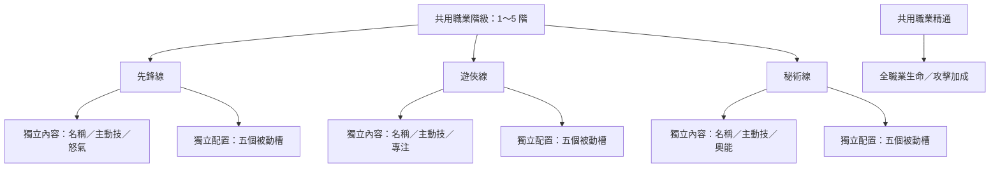

---

## 1. 玩家體驗流程

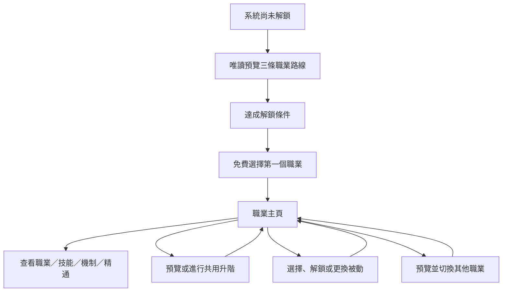

### 1.1 首次選擇職業

- 系統未解鎖時，玩家仍可唯讀預覽三個職業。
- 預覽卡顯示職業名稱、定位、初始主動技能與專屬機制。
- 系統解鎖後，玩家可免費三選一，進入第一階職業。
- 職業名稱應描述玩法氣質、戰鬥節奏或世界觀身分，例如「先鋒／遊俠／秘術師」，避免直接綁定弓、劍、法杖等特定武器。

### 1.2 職業主頁

主頁需讓玩家快速回答以下問題：

1. 我現在是什麼職業、處於第幾階？
2. 這個職業的專屬機制是什麼？
3. 我目前的主動技能與五個被動槽是什麼？
4. 我的共用職業精通提供多少生命與攻擊加成？
5. 現在能否升階，或下一階需要多少等級？

主頁顯示內容：

- 職業示意角色、名稱與定位色標。
- 專屬機制的一行摘要，可展開查看完整規則。
- 職業精通總值、生命加成、攻擊加成與「全職業共用」標籤。
- 目前主動技能完整說明。
- 五個被動槽。
- 「切換職業」及「職業升階預覽／職業升階」按鈕。

玩家目前等級只顯示在左上全域 HUD；職業資訊區不重複顯示。下一階門檻放在升階按鈕附近。

---

## 2. 職業階級與升階

### 2.1 五階共用進度

- 職業階級固定為五階，沒有二次分支。
- 三條職業線共用同一個職業階級。
- 玩家升至第 N 階時，三條職業線的第 N 階名稱、主動技能與被動槽同步開放。
- 切換至其他職業時，直接使用目前的共用階級，不需要重新升階。

### 2.2 升階條件與獎勵

升階需要：

- 達到玩家等級門檻。
- 支付升階資源。

升階後：

- 目前職業名稱更新為新階段名稱。
- 主動技能替換為該階的新技能。
- 第二至五階各開放一個新的三選一被動槽。
- 獲得一次較大量的職業精通。

### 2.3 升階預覽

玩家尚未達到等級門檻時，仍可進入升階預覽，提前查看下一階內容；只有最後的升階確認不可操作。

升階頁顯示：

- 目前階段與下一階段的職業示意。
- 舊主動技能與新主動技能的對比。
- 本次開放的三個被動候選。
- 等級不足時的「目前等級／需求等級」。
- 達標後的升階資源消耗。

升階頁不顯示下一階職業簡介、武器偏好、裝備限制或精通拆解，避免資訊過量。

主頁升階按鈕狀態：

| 狀態 | 主文案 | 副文案 |
|---|---|---|
| 等級不足 | 職業升階預覽 | 需 Lv.N |
| 可以升階 | 職業升階 | 資源消耗 |
| 已達五階 | 職業階級已滿 | 無 |

---

## 3. 主動技能與被動技能

### 3.1 主動技能

- 每個職業階段對應一個主動技能。
- 升階時直接替換成新技能，不是同一技能單純提高數值。
- 主動技能卡直接顯示完整說明與冷卻時間，不再另外開技能詳情彈窗。

### 3.2 五個被動槽

| 槽位 | 開放時機 | 規則 |
|---|---|---|
| 槽位 1 | 第一階 | 固定被動，自動取得且不可替換 |
| 槽位 2 | 第二階 | 三選一 |
| 槽位 3 | 第三階 | 三選一 |
| 槽位 4 | 第四階 | 三選一 |
| 槽位 5 | 第五階 | 三選一 |

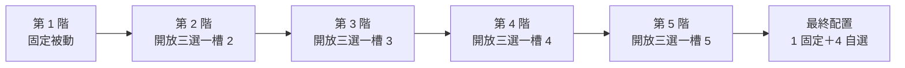

三選一候選為固定內容，不是隨機抽取。候選應提供橫向玩法差異，避免存在明顯唯一正解。

建議候選方向為：

- 輸出型。
- 生存型。
- 專屬機制連動型。

此分類仍可依各職業玩法調整，不要求每槽機械式套用相同比例。

### 3.3 選擇、解鎖與更換

- 新槽開放後可以暫時不選，不會阻擋後續升階。
- 第一次選擇免費，同時解鎖並裝備該候選。
- 同槽另外兩個候選需分別支付一次性資源解鎖。
- 已解鎖候選之間可免費自由切換。
- 被動解鎖使用的資源應比切換職業資源更容易取得。

### 3.4 被動槽 UI 狀態

| 狀態 | 顯示與操作 |
|---|---|
| 固定被動 | 圖示、名稱與「固定」標籤；點擊可快速查看內容 |
| 尚未開放 | 鎖頭與開放階級；不可操作 |
| 已開放、尚未選擇 | 問號與提示紅點；點擊進入三選一 |
| 已選擇 | 顯示目前裝備的圖示與名稱；點擊先看簡短 bubble，再進入管理面板 |

開啟正式的選擇／解鎖面板前，需先關閉 bubble，避免畫面同時疊出多層資訊。

---

## 4. 切換職業

- 玩家可支付資源，在三條職業線之間切換。
- 職業階級、職業精通、生命與攻擊加成全部保留。
- 每條職業線的被動解鎖與裝備配置獨立保存；切回時恢復離開前的狀態。
- 切換職業不會卸下、替換或限制任何裝備。

### 4.1 切換列表

切換列表以三條橫列呈現三個職業。每列顯示五階職業示意：

- 已開放階段正常顯示。
- 尚未開放階段顯示剪影。
- 目前職業有明確標記。
- 列表需說明「職業階級全職業共用」與目前階級。

### 4.2 目標職業預覽

點擊其他職業後，進入唯讀預覽頁，顯示：

- 目前職業到目標職業的切換關係。
- 目標職業的專屬機制。
- 目標職業在目前共用階級下的主動技能。
- 目標職業的五個被動槽目前配置。

被動槽顯示規則：

- 固定槽顯示固定被動。
- 已選槽顯示目前裝備的被動。
- 尚未選擇顯示「待選 · 3 選 1」。
- 尚未到達階級顯示鎖定。

點擊已開放槽位後，在同一頁固定區域查看該槽三個候選與單一候選說明。此處只供了解玩法，不可直接選擇、解鎖或更換；玩家完成職業切換後，再回主頁管理。

---

## 5. 職業精通與專屬機制

### 5.1 職業精通

職業精通是三條職業線共用的永久成長值，直接增加生命與攻擊。

精通來源：

- 首次取得第一階職業。
- 每次提升共用職業階級。
- 首次取得各線固定被動。
- 每個三選一候選首次解鎖。

升階提供的精通應高於單一被動解鎖。切換職業、切回原職業或在已解鎖候選之間更換，不會重複獲得精通。

主頁只顯示：

```text
職業精通　245　　全職業共用
生命 +2,450　　　攻擊 +245
```

不顯示來源拆解、精通等級、進度條或下一門檻。

### 5.2 職業專屬機制

每條職業線擁有一種資源條，主動技能與部分被動會與其連動。

| 職業線示例 | 資源 | 已確定的累積方式 |
|---|---|---|
| 先鋒線 | 怒氣 | 受到傷害時累積 |
| 遊俠線 | 專注 | 攻擊命中時累積 |
| 秘術線 | 奧能 | 施放技能時累積 |

戰鬥外的職業主頁不顯示資源目前數值，只顯示資源名稱與一句累積方式。完整上限、衰減、消耗及技能連動方式仍待後續設計。

---

## 6. 職業與裝備的關係

核心原則：**職業決定玩法，不決定裝備。**

- 職業不影響裝備掉落、抽取、鍛造、權重或保底。
- 所有職業都能使用所有武器與防具。
- 選擇、升階或切換職業時，不會卸下或轉換玩家裝備。
- 戰鬥角色外觀仍由既有裝備與神器系統決定。
- 近戰／遠程、攻擊距離與攻擊動畫仍由目前有效武器決定。
- 職業技能的核心循環不得要求特定武器或固定攻擊距離。
- 職業圖示與示意立繪只用於職業 UI 辨識，不會套用到戰鬥角色身上。

---

## 7. UI／UX 原則

### 7.1 頁面位置

- 職業頁位於既有 **Upgrades** 頁中。
- 與「技能／寵物／科技樹」同層，形成「技能／寵物／職業／科技樹」四個分頁。
- Upgrades 分頁列位於全域主導覽上方。

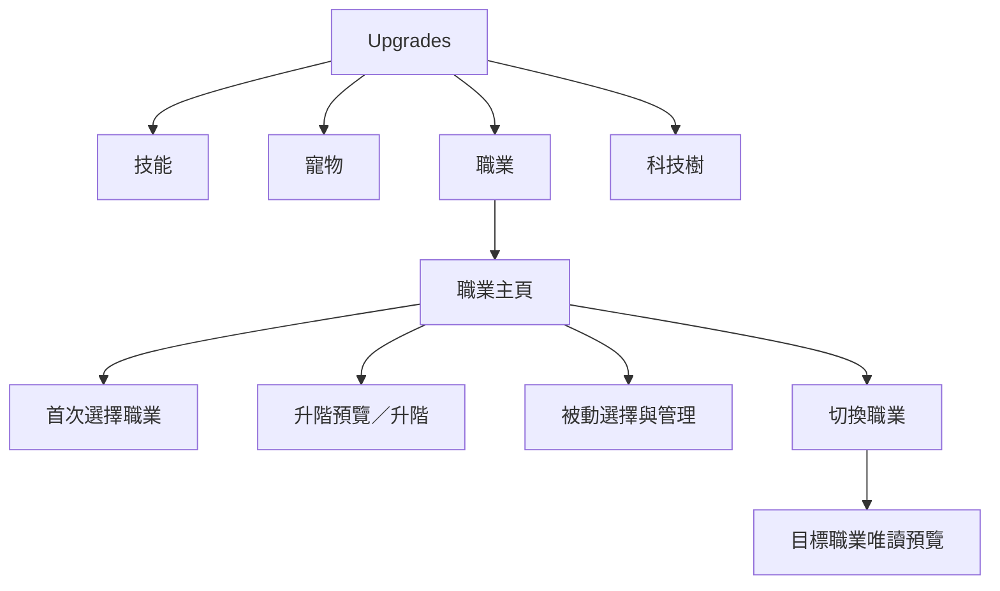

### 7.2 畫面參考

既有 Upgrades 頁的整體結構如下。職業頁需沿用其上方資源資訊、內容區、Upgrades 分頁列與最下方全域主導覽的層級。

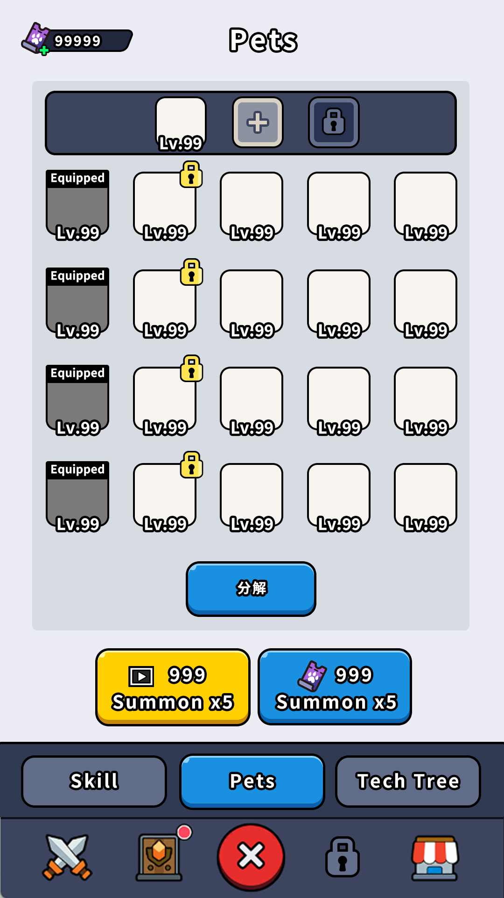

職業分頁加入後的分頁位置示意：

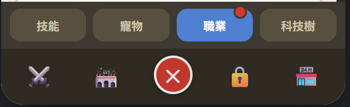

#### Demo 關鍵流程截圖

以下畫面以 1080×1920 的手機比例呈現目前互動方向；圖中的技能名稱、數值與美術皆為流程佔位。

**職業主頁**：集中回答目前職業、專屬機制、共用職業精通、主要技能與被動配置。

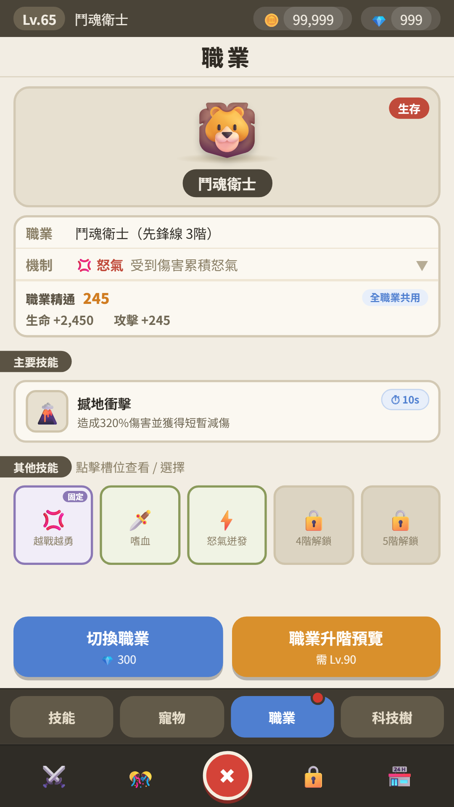

**升階預覽**：在同一層面板比較職業名稱、主要技能變化與下一個被動三選一槽位。

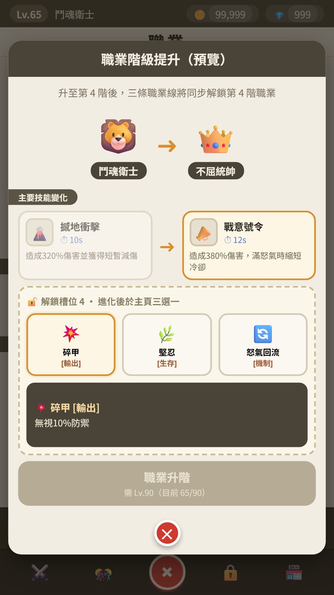

**被動三選一**：以單一底部面板呈現三個候選，避免再疊加技能彈窗。

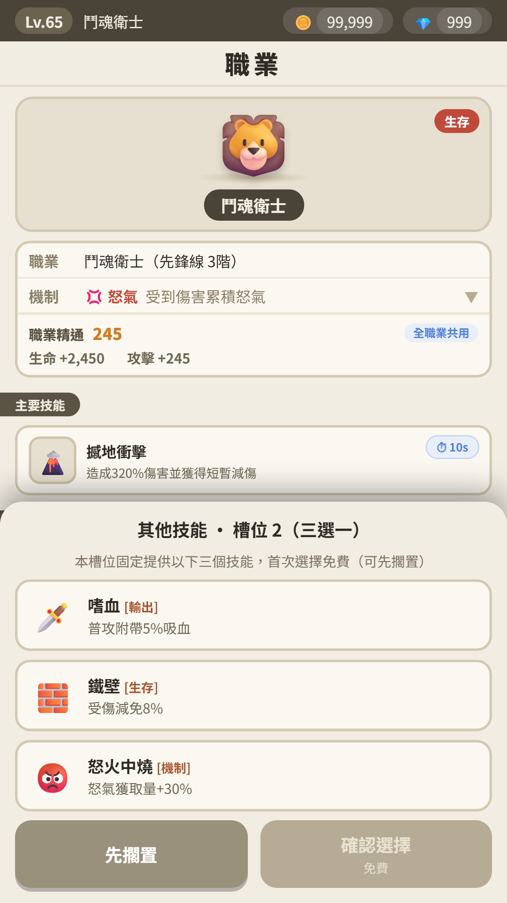

**切換職業列表**：一次比較三條職業線、目前階級與後續階級輪廓。

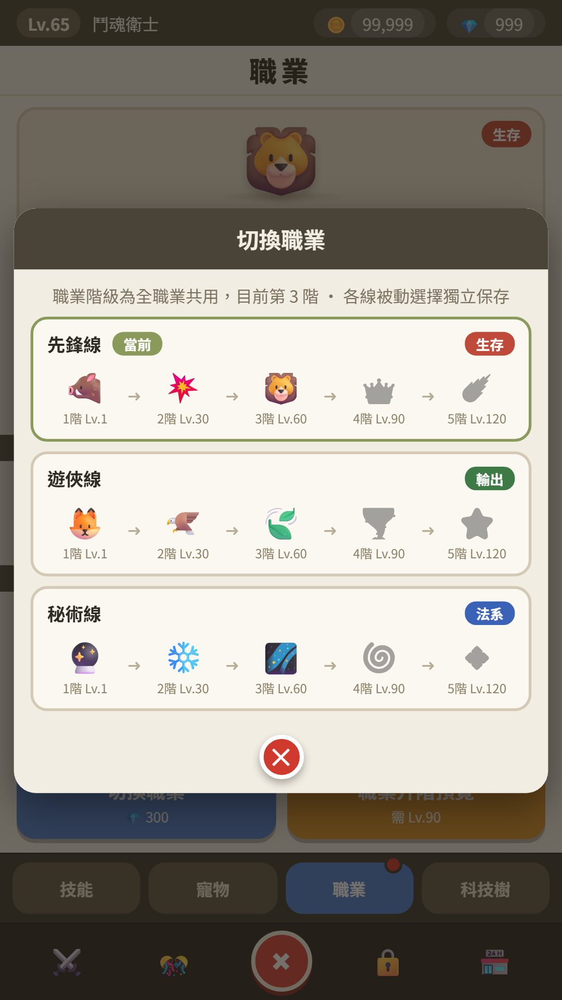

**目標職業預覽**：切換前查看目標職業的機制、主要技能與被動候選；此頁只預覽，不直接配置。

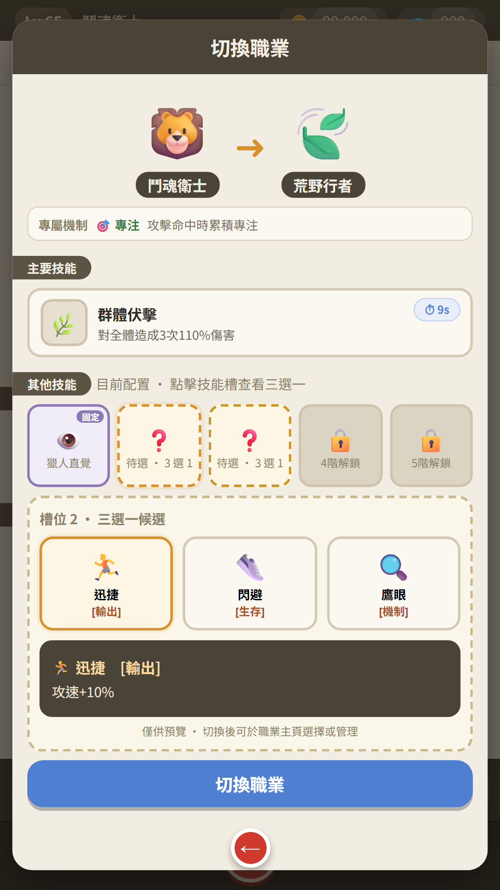

### 7.3 畫面與資訊量

- 設計基準為 **1080×1920、9:16 手機畫面**。
- 職業主頁、選職業、升階、切換詳情與被動三選一，標準內容量下都不需要上下滑動。
- 操作按鈕不得覆蓋 Upgrades 分頁列或全域主導覽。
- 資訊增加時，優先縮短文字、使用 bubble 或固定詳情區，不在主要流程加入內部垂直捲動。

### 7.4 單層互動

- 同一時間最多只顯示一層正式操作面板。
- 簡短技能內容可使用 bubble 快覽。
- 需要選擇或付費的操作使用正式面板。
- 從 bubble 進入正式面板時，bubble 必須先關閉。
- 升階與切換頁的三選一預覽使用同頁固定詳情區，不再疊加技能彈窗。

### 7.5 提示與回饋

- 可升階與待選被動都使用紅點提示，不使用持續呼吸光效。
- 升階是否可用主要由按鈕文案與資源資訊表達。
- 新被動槽開放可使用一次性動畫，但不持續干擾玩家。
- 升階成功與切換成功可共用結果頁形式：目標職業示意、主動技能與其他技能。

---

## 8. 目前內容佔位

以下內容目前只用於驗證流程與 UI，不應視為正式內容定案：

- 各階職業正式名稱與描述。
- 所有主動技能與被動技能名稱。
- 技能效果、倍率、冷卻與標籤。
- 各階玩家等級門檻。
- 升階、切換及解鎖被動的資源種類與消耗數值。
- 精通獎勵量與生命／攻擊換算。
- 怒氣、專注與奧能的完整上限、消耗、衰減及技能連動。

---

## 9. 本次 Review 建議關注事項

### 系統理解

- 是否能快速理解「職業階級三線共用、被動配置各線獨立」？
- 是否會誤以為職業限制武器、近遠程或角色裝備外觀？
- 五階、主動技能替換與五個被動槽的成長節奏是否清楚？

### 資訊架構

- 主頁是否能在短時間回答目前職業、機制、技能、精通與升階條件？
- 等級資訊分工是否清楚：全域 HUD 顯示目前等級，升階操作顯示下一階門檻？
- 升階與切換預覽是否提供足夠資訊，但不變成第二套技能管理頁？

### 操作流程

- 被動的「首次免費、其餘解鎖、已解鎖免費切換」是否容易理解？
- bubble、正式面板與固定詳情區的使用時機是否一致？
- 各主要操作能否在 9:16 單畫面完成，且不產生多層彈窗壓力？

### 待後續定案

- 系統正式解鎖條件。
- 各階正式名稱與等級門檻。
- 升階、切換與被動解鎖的資源種類及數值。
- 三選一被動是否固定採用「輸出／生存／機制連動」分類。
- 三條職業線的完整資源循環與技能內容。
- 精通成長量與生命／攻擊換算曲線。

---

## 參考檔案

- `職業系統demo.html`：目前可操作 Prototype。
- `職業系統規格.md`：包含完整規則、資料與實作備註的原始規格。
