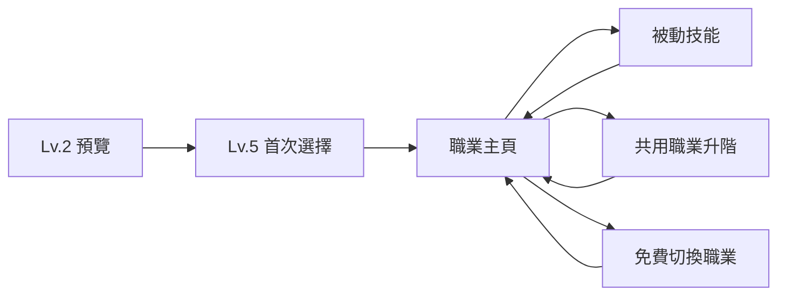
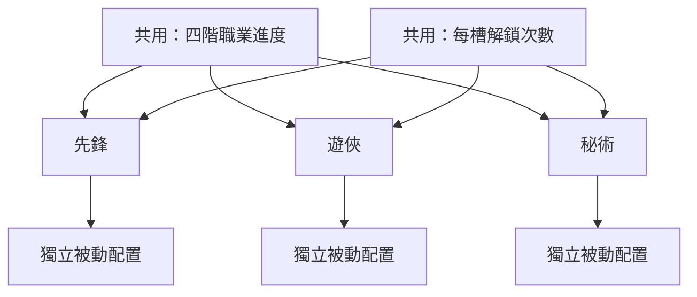

# 職業系統｜設計 Review 摘要

> 本文件供遊戲設計快速 Review 系統結構。完整行為、例外與驗收條件以 [`職業系統規格.md`](./職業系統規格.md) 為準。

## 一眼理解

玩家在早期從三條職業線選擇一條。三條線共用四階職業進度與每槽解鎖次數，但各自保存被動候選的解鎖與裝備配置；玩家可以免費切換職業。

## 核心結構

| 項目 | 規則 |
|---|---|
| 職業線 | 初期三條：先鋒、遊俠、秘術為 Prototype 代稱 |
| 職業階級 | 三線共用四階；切換職業不需重練 |
| 主動技能 | 每條線每階一個，升階或切換後替換 |
| 被動槽 | 主頁固定五槽；第一至四階各開一槽，第五槽本版維持鎖定 |
| 候選技能 | 每條線、每個槽位固定三個候選，同時裝備一個 |
| 解鎖次數 | 每槽 `0/3`～`3/3` 全職業共用，代表每條線可解鎖的候選上限 |
| 被動配置 | 各職業線獨立保存已解鎖候選與目前裝備 |
| 切換職業 | 免費；保留階級、共用解鎖次數與各線配置 |

## 階級與被動槽

| 階級 | Prototype 等級門檻 | 內容 |
|---|---:|---|
| 第 1 階 | Lv.5 | 第一階職業與主動技能、槽位 1 |
| 第 2 階 | Lv.30 | 第二階職業與主動技能、槽位 2 |
| 第 3 階 | Lv.60 | 第三階職業與主動技能、槽位 3 |
| 第 4 階 | Lv.90 | 第四階職業與主動技能、槽位 4 |
| 第五被動槽 | 尚未定義 | 主頁保留位置，本版鎖定 |

- 每個新槽位開放時，共用解鎖次數至少為 `1/3`。
- 共用次數是每條線的候選解鎖上限，不是會被不同職業互相消耗的票券。
- 提高某槽共用次數後，其他職業線立即取得相同的免費候選解鎖額度。
- 已解鎖候選可免費切換。

## 系統開放

第一版預設採玩家等級與提前預覽：

| 時點 | 玩家看到的內容 |
|---|---|
| Lv.1 | 鎖定資訊 |
| Lv.2～4 | 三張唯讀職業卡 |
| Lv.5 | 正式三選一與紅點 |
| 首次選擇後 | 職業主頁與一次性「切換職業」引導任務 |

第一優先 A/B 只比較「Lv.2 提前預覽」與「Lv.5 直接開放」，正式解鎖都固定在 Lv.5。關卡 1-5／1-10 是後續候選，需先校準到相近遊戲時間。

## 職業專屬戰鬥資源

| 職業線 | 資源 | 已確認累積方式 |
|---|---|---|
| 先鋒 | 怒氣 | 受到傷害 |
| 遊俠 | 專注 | 攻擊命中 |
| 秘術 | 奧能 | 施放技能 |

資源上限、衰減、消耗及技能連動尚未定案。職業主頁不顯示機制說明欄。

## 職業與裝備

**職業決定技能與機制，不決定裝備。**

- 不影響裝備掉落、抽取、鍛造池、權重或保底。
- 不限制武器、防具、近戰或遠程。
- 不改變戰鬥角色外觀；外觀仍由裝備與神器決定。
- 職業 UI 角色圖不會套用至戰鬥角色。

## 本輪 Review 重點

- 四階職業圖搭配五個被動槽，第五槽暫時鎖定是否可接受。
- 「共用解鎖上限、各線獨立配置」是否足夠容易理解。
- 主動技能與專屬資源是否能形成三條線的玩法差異。
- Lv.2 預覽、Lv.5 解鎖是否符合早期系統節奏。

## 尚待內容定案

- 正式職業名稱、美術與定位 Tag。
- 主動／被動技能效果與平衡數值。
- 升階與被動解鎖資源、價格。
- 第五被動槽的開放來源。
- 三種專屬資源的完整戰鬥循環。
